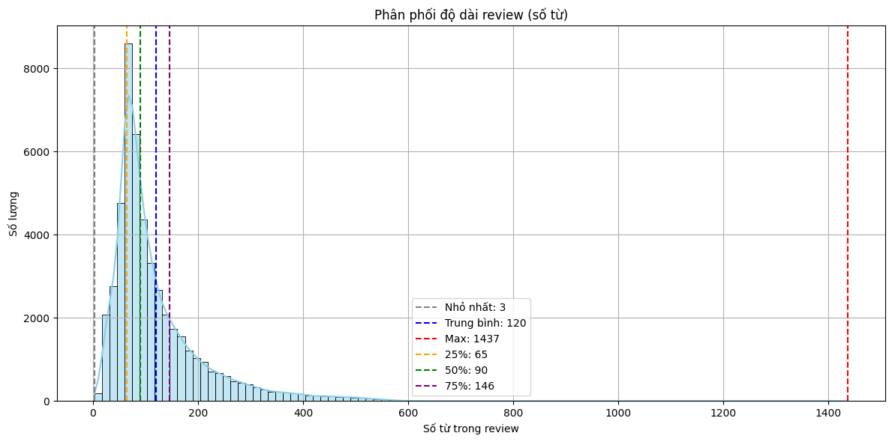
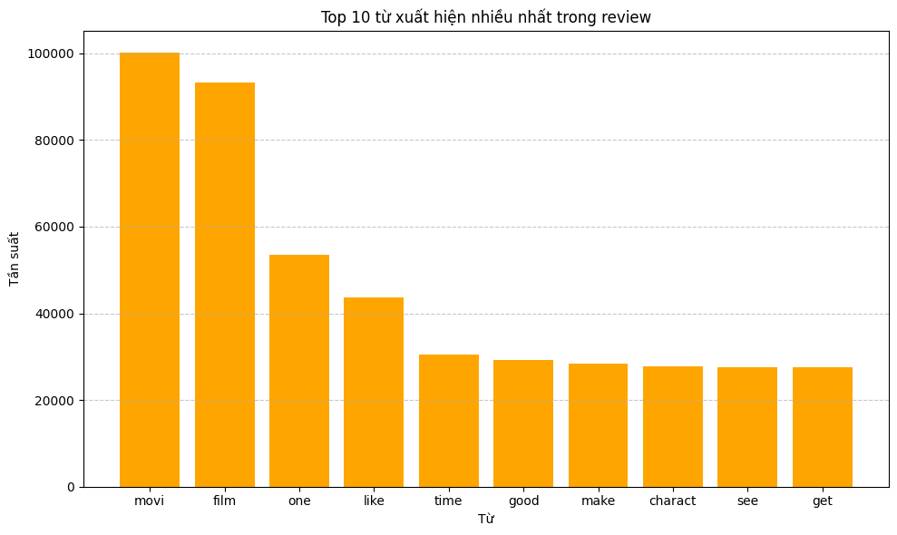
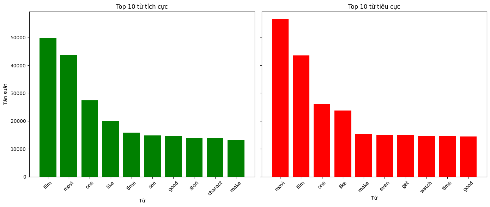
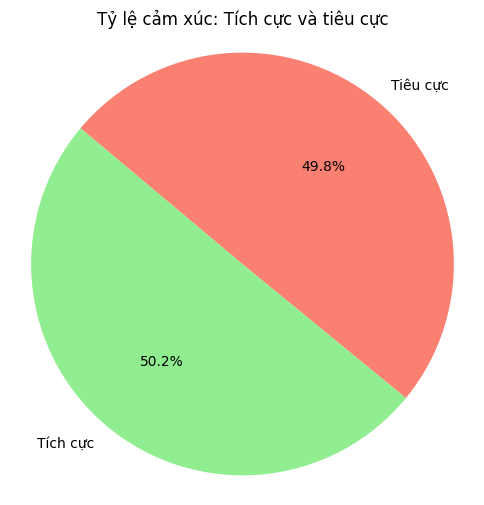
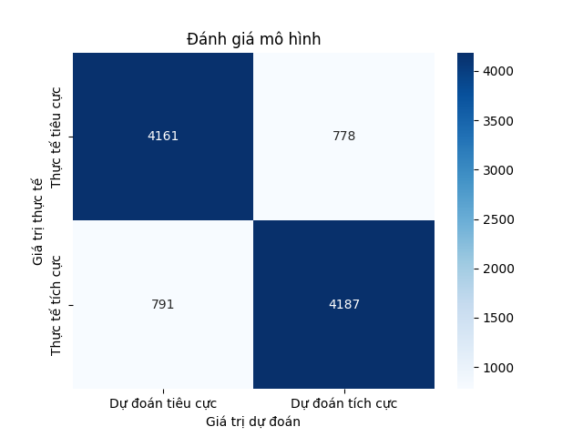
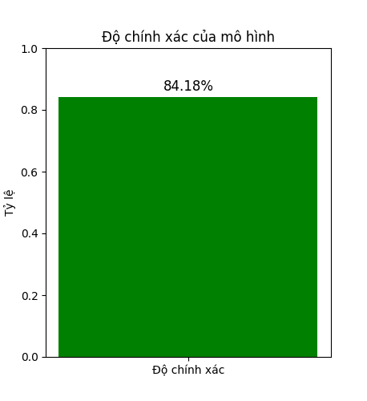
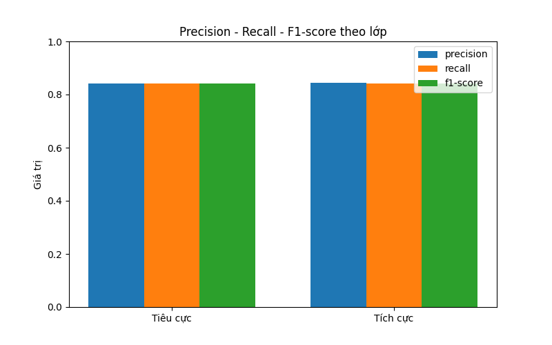

# 🎬 IMDB Sentiment Classification

  

Phân tích và phân loại cảm xúc (tích cực / tiêu cực) trong các bình luận phim trên IMDB bằng mô hình học máy **Random Forest**.

---

## 📌 Mục tiêu

- Tiền xử lý, EDA từ tập dữ liệu IMDB
- Huấn luyện và đánh giá mô hình phân loại cảm xúc
- Dự đoán cảm xúc từ bình luận mới

---

## 🗂️ Cấu trúc thư mục
```
    imdb-sentiment-classification/
    │
    ├── data/ # chưa dữ liệu thô
    │ └──  IMDB_Dataset.csv
    │ 
    ├── notebook/ # tiền xử lý và eda 
    │ └──  eda-and-preprocessing.iynb
    │
    ├── output/ # kết quả đầu ra là data đã làm sạch và file lưu mô hình
    │ ├── data_cleaned.csv
    │ ├── random_forest_model.pkl
    │ └── vector.pkl
    │
    ├── result/ # Chứa ảnh kết quả
    │
    ├── src/ 
    │ ├── model_RandomForest.py # mô hình randomforest
    │ └── utils.py
    │
    ├── config.py 
    ├── main.py 
    └── README.md
```

## 🚀 Công nghệ sử dụng

- **Python:** Ngôn ngữ lập trình chính cho toàn bộ dự án.
- **Pandas:** Đọc và xử lý dữ liệu CSV, thao tác dữ liệu dạng bảng.
- **Scikit-learn:**
  - **TfidfVectorizer:** Vector hóa văn bản bằng phương pháp TF-IDF.
  - **train_test_split:** Chia tập dữ liệu thành tập huấn luyện và kiểm tra.
  - **RandomForestClassifier:** Mô hình học máy để phân loại cảm xúc.
  - **classification_report, confusion_matrix, accuracy_score:** Đánh giá hiệu suất mô hình.
- **Matplotlib & Seaborn:** Vẽ biểu đồ trực quan hóa như ma trận nhầm lẫn và biểu đồ cột.
- **Joblib:** Lưu và tải lại mô hình học máy và vectorizer dưới định dạng `.pkl`.
- **os & sys:** Hỗ trợ xử lý đường dẫn và import module từ thư mục cha.

---

## ⚙️ Cài đặt

```bash
git clone https://github.com/DODANGHOANCNTT2K15/imdb-sentiment-classification.git
cd imdb-sentiment-classification
pip install pandas scikit-learn matplotlib seaborn joblib
```

Sau đó 

```bash
python main.py
```
--- 

## ✨ Cách thức hoạt động 

1. Tiền xử lý và EDA (file: `eda-and-preprocessing.py`):
- Nguồn dataset `IMDB_Dataset.csv` (IMDB Dataset of 50K Movie Reviews): https://www.kaggle.com/datasets/lakshmi25npathi/imdb-dataset-of-50k-movie-reviews/data. Đây là tập dữ liệu gồm **50.000 bình luận phim**, mỗi bình luận được gắn nhãn `positive` hoặc `negative`.
- Đầy tiên, thực hiện đọc file csv `IMDB_Dataset.csv` bằng pandas. Hiện thị nội dung dạng bảng.
- Kiểm tra dataset bằng `info()`, `description()`, có giá trị `NULL` không, có trùng dữ liệu, nôi dung.  
- Tiếp theo, Làm sạch dữ liệu:
    - Xóa bỏ các bình luận bị trùng lặp.
    - Xử lý phần review xóa các phần tử html.
    - Xử lý đưa hết chữ hòa về chữ thường.
    - Xóa bỏ các ký tự đặc biệt.
    - Xóa stopwords - stopwords là những từ rất phổ biến trong ngôn ngữ nhưng không mang nhiều ý nghĩa trong việc phân tích văn bản. Stopwords xuất hiện nhiều nhưng không giúp gì cho việc phân tích ý nghĩa. Xóa đi cho mô hình đỡ bị nhiễu, hơn nữa còn giảm số chiều của dữ liệu, tăng tốc độ học.
    - Stemming -  Stemming là quá trình chuyển một từ về gốc của nó, bằng cách cắt bỏ các hậu tố như -ing, -ed, -s. Ví dụ running về run.
- Sau khi làm sạch, lưu dữ liệu mới đã được làm sạch vào `output/data_clean.csv` để chuẩn bị dữ liệu huấn luyện model **Random Forest** sau này.
- Bước tiếp theo EDA - Phân tích dữ liệu khám phá:
    - Phân phối độ dài của các review:


    - Top 10 từ xuất hiện trong review:


    - Top 10 từ xuất hiện phổ biến theo cảm xúc


    - Tỉ lệ giữa review tích cực và tiêu cực 


2. Huấn luyện model random forest (file: `model_Random_Forest.py`):
- Đọc file csv đã được làm sạch dữ liệu, sau đó chuyển đổi nhãn `positive` / `negative` thành giá trị nhị phân `1` / `0`. Phải chuyển nhãn vì mô hình Random forest không xử lý được dữ liệu dạng chuỗi (string).
- Tiếp theo, Vecter hóa văn bản. Vì mô hình chỉ xử lý được vecter số nên ta phải biến các chuỗi văn bản này thành dạng vecter số.
- Tiếp theo, Chia tập dữ liệu thành 2 phần 20% dữ liệu sẽ được làm tập kiểm thử cho mô hình, còn 80% dùng làm để huẩn luyện.
- Áp dụng mô hình `RandomForestClassifier` để học từ tập huấn luyện (80% dữ liệu).
- Kết quả huấn luyện:
    - Đánh giá mô hình


    - Độ chính xác của mô hình


    - Precision, Recall, F1-core theo lớp
    

- Cuối cùng là mô hình và vector hóa được lưu dưới dạng `.pkl` bằng thư viện `joblib` để tái sử dụng sau.
3. Thực hiện dự đoán một review mới (file: `main.py`)
- Load mô hình đã được huấn luyện trước đó gồm `randow_forest_model.pkl` và `vector.pkl`.
- Tiếp theo, người dùng nhập vào một đoạn review. Ví dụ: `this movie is nice`.
- Thực hiện làm sạch dự liệu nhập vào này như xử ở bước tiền xử lý dữ liệu. Điều này tránh việc người dùng nhập dữ liệu gồm các html,... 
- Cuối cùng là mô hình sẽ dự đoán câu review này là `positive` hay `negative`.
- Ví dụ:


---

## 📞 Author
- **Name:** DO DANG HOAN
- **Contact:** dodanghoana12017@gmail.com